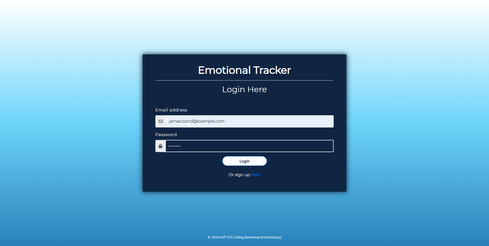
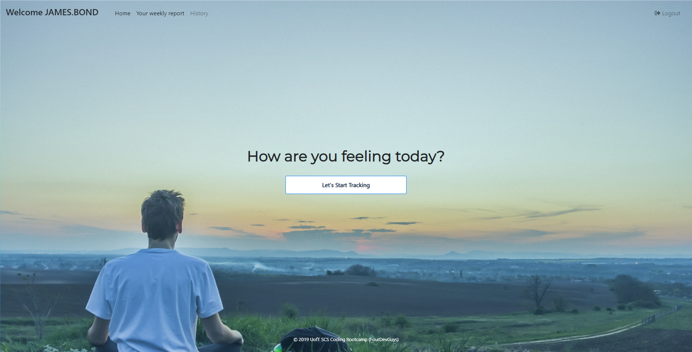
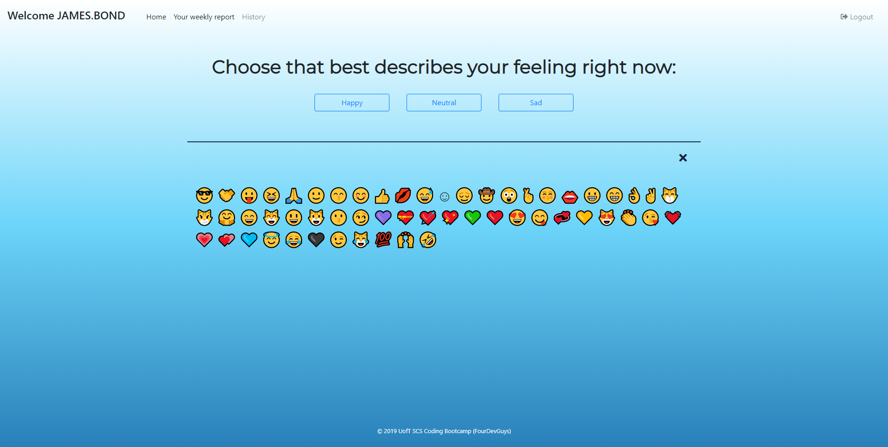
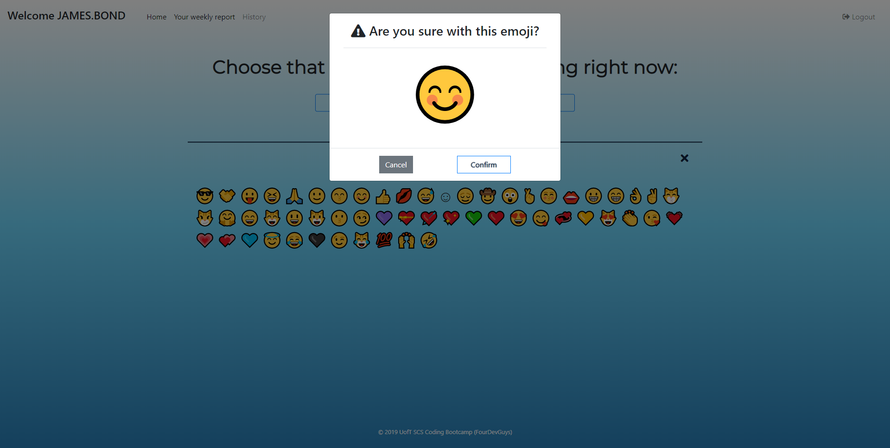
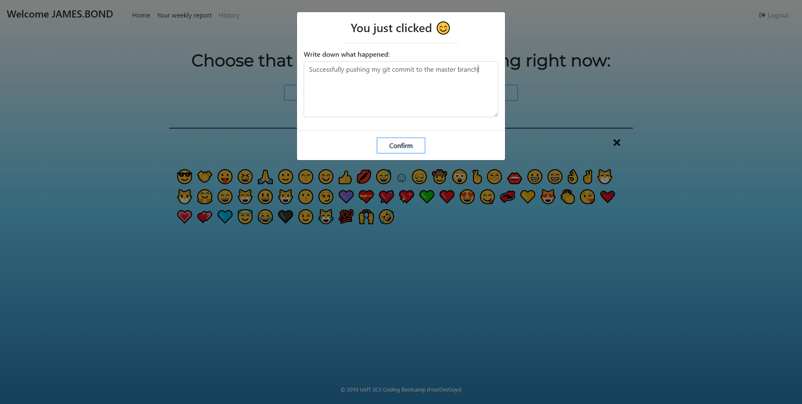
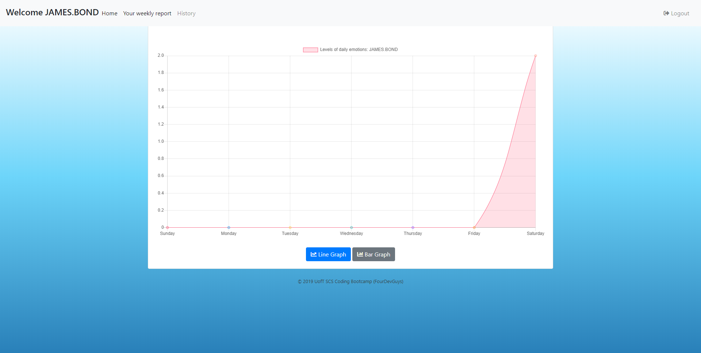
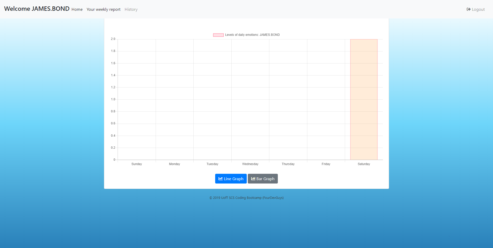
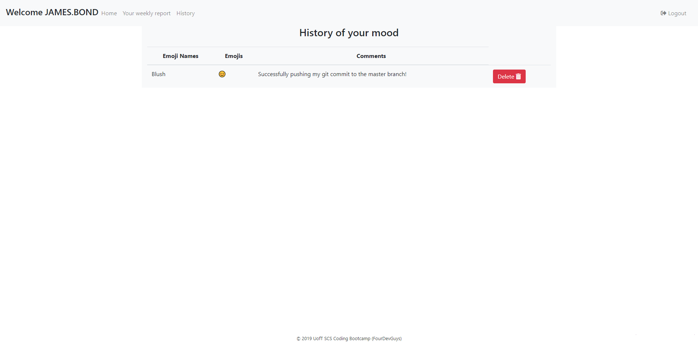


# Emotional Tracker

It's an app that tracks and records the user's mood in a day. 

**Project Requirements:**
	:white_check_mark: Use a Node and Express Web Server;
	
:white_check_mark: Be backed by a MySQL Database an ORM (not necessarily Sequelize);

:white_check_mark: Have both GET and POST routes for retrieving and adding new data;

:white_check_mark: Be deployed using Heroku (with Data);

:white_check_mark: Utilize at least one new library, package, or technology that we haven’t discussed;

:white_check_mark: Have a polished frontend / UI;

:white_check_mark: Have folder structure that meets MVC Paradigm;

:white_check_mark: Meet good quality coding standards (indentation, scoping, naming).

:white_check_mark: Must not expose sensitive API key information on the server
	
## :open_file_folder: Files
```
Project-2
├─ .git
│  ├─ config
│  ├─ description
│  ├─ FETCH_HEAD
│  ├─ HEAD
│  ├─ hooks
│  │  ├─ applypatch-msg.sample
│  │  ├─ commit-msg.sample
│  │  ├─ fsmonitor-watchman.sample
│  │  ├─ post-update.sample
│  │  ├─ pre-applypatch.sample
│  │  ├─ pre-commit.sample
│  │  ├─ pre-push.sample
│  │  ├─ pre-rebase.sample
│  │  ├─ pre-receive.sample
│  │  ├─ prepare-commit-msg.sample
│  │  └─ update.sample
│  ├─ index
│  ├─ info
│  │  └─ exclude
│  ├─ logs
│  ├─ objects
│  │  ├─ info
│  │  └─ pack
│  │     ├─ pack-86a852185d999dd5f907cb1ce416d3b79eff09fc.idx
│  │     └─ pack-86a852185d999dd5f907cb1ce416d3b79eff09fc.pack
│  ├─ packed-refs
│  └─ refs
│     ├─ heads
│     │  └─ master
│     ├─ remotes
│     │  └─ origin
│     │     └─ HEAD
│     └─ tags
├─ .gitignore
├─ config
│  ├─ config.json
│  ├─ middleware
│  │  └─ isAuthenticated.js
│  └─ passport.js
├─ db
│  ├─ schema.sql
│  └─ seeds.sql
├─ migrations
│  ├─ 20190817004451-create-users.js
│  ├─ 20190817005132-create-emojis.js
│  └─ 20190818000728-create-user-emojis.js
├─ models
│  ├─ emojis.js
│  ├─ index.js
│  ├─ users.js
│  └─ user_emojis.js
├─ package-lock.json
├─ package.json
├─ public
│  ├─ assets
│  │  ├─ css
│  │  │  ├─ chartStyle.css
│  │  │  └─ style.css
│  │  ├─ img
│  │  │  └─ img-0.jpg
│  │  └─ js
│  │     ├─ chart.js
│  │     ├─ emoji.js
│  │     ├─ history.js
│  │     ├─ login.js
│  │     ├─ members.js
│  │     └─ signup.js
│  ├─ chart.html
│  ├─ history.html
│  ├─ images
│  │  ├─ Screenshot (3).png
│  │  ├─ Screenshot1.png
│  │  ├─ Screenshot2.png
│  │  ├─ Screenshot3.png
│  │  ├─ Screenshot4.png
│  │  ├─ Screenshot5.png
│  │  ├─ Screenshot6.png
│  │  ├─ Screenshot7.png
│  │  └─ Screenshot8.png
│  ├─ login.html
│  ├─ members.html
│  ├─ migrations
│  │  ├─ 20190817004451-create-users.js
│  │  ├─ 20190817005132-create-emojis.js
│  │  └─ 20190818000728-create-user-emojis.js
│  ├─ models
│  │  ├─ emojis.js
│  │  ├─ index.js
│  │  ├─ users.js
│  │  └─ user_emojis.js
│  ├─ package-lock.json
│  ├─ package.json
│  ├─ public
│  │  ├─ assets
│  │  │  ├─ css
│  │  │  │  ├─ chartStyle.css
│  │  │  │  └─ style.css
│  │  │  ├─ img
│  │  │  │  └─ img-0.jpg
│  │  │  └─ js
│  │  │     ├─ chart.js
│  │  │     ├─ emoji.js
│  │  │     ├─ history.js
│  │  │     ├─ login.js
│  │  │     ├─ members.js
│  │  │     └─ signup.js
│  │  ├─ chart.html
│  │  ├─ history.html
│  │  ├─ login.html
│  │  ├─ members.html
│  │  ├─ signup.html
│  │  └─ stylesheets
│  │     └─ style.css
│  ├─ README.md
│  ├─ routes
│  │  ├─ emotion-api-routes.js
│  │  ├─ html-api-routes.js
│  │  ├─ user-api-routes.js
│  │  └─ user-emoji-api-routes.js
│  ├─ seeders
│  │  ├─ 20190817235617-demo-users.js
│  │  ├─ 20190817235631-demo-emojis.js
│  │  └─ 20190818165255-demo-user-emojis.js
│  ├─ server.js
│  ├─ signup.html
│  ├─ stylesheets
│  │  └─ style.css
│  └─ views
│     ├─ index.handlebars
│     └─ layouts
│        └─ main.handlebars
├─ README.md
├─ routes
│  ├─ emotion-api-routes.js
│  ├─ html-api-routes.js
│  ├─ user-api-routes.js
│  └─ user-emoji-api-routes.js
├─ screenshots
│  ├─ img-0.png
│  ├─ img-1.png
│  ├─ img-2.png
│  ├─ img-3.png
│  ├─ img-4.png
│  ├─ img-5.png
│  ├─ img-6.png
│  └─ img-7.png
├─ seeders
│  ├─ 20190817235617-demo-users.js
│  ├─ 20190817235631-demo-emojis.js
│  └─ 20190818165255-demo-user-emojis.js
├─ server.js
└─ views
   ├─ index.handlebars
   └─ layouts
      └─ main.handlebars
```

## Technologies
- JavaScript 
  - dotenv
  - Nodejs
  - jQuery
  - mysql
  - express
  - express-handlebars
  - chart.js
  - bcryptjs
  - emoji-emotion
  - passport
  - sequelize
  - ORM
- MySQL & MySQL Workbench
- JAWS DB
- Handlebars
- Bootstrap
- Google Fonts
- Fontawesome
- Heroku

## Install
To clone this project to your device, type the `code` below to your git bash:
```bash
git clone https://github.com/itshally/Project-2.git
```

Then, type the code to run the project:
```bash
cd Project-2
npm install
```
Inside the **config** folder, modify the **"development"** property in the **config.json** file if you want to run it locally. 

**:pencil: Note:**
- In your MySQL Workbench, open and execute all of the statements in the **schema.sql** file first before the **seeds.sql*** file. These files are in the **db** folder.
- Make sure that in your **Users and Privileges** *(you can find it under that **Management** of your left sidebar)*, the user account that you are using for this app **has an access rights to the schema**. Mine is `user` as my user account for my MySQL.
- Afterwards, try to modify the lines 2-8 of the **config.json** file if there are some changes needed:
	```javascript
		"development":  {
			"username":  "user",
			"password":  "",
			"database":  "db_emotions",
			"host":  "127.0.0.1",
			"dialect":  "mysql",
			"operatorsAliases":  false
		},
	```

## Usage
It's being deployed on Heroku.

Make sure you have a Heroku account. If you have one:
- Create a new app and name it whatever you want as long as it is available, but leaving the input field for the **App name** empty is still fine because it will automatically generate one for you.
- After, go to your **Resources** tab and search for **JawsDB MySQL** as your add-on (don't worry it's FREE). You can view your database connection there once you clicked it.
- Make sure that in your **Settings** tab, you have your `heroku/nodejs` buildpack added.
- Then in your **Deploy** tab, you can connect your Github and search for your repository. Click the **Automatic Deploys** button and then click the **Deploy branch** button below. The default branch is **master**.

## Screenshots
Here is an available screenshot:

- This is the login page
	

- After the user logs in, this will be the home page
	

- When the user clicks the ***Let's Start Tracking*** button, it will redirect to a new page. This page divided the emojis into 3 categories: Happy, Neutral, and Sad. In this screenshot, **Happy** button was clicked.
	

- A confirmation window for the emoji is being showed up
	

- After confirming the emoji, a text field will appear to add some notes regarding about what happened for the user to feel that way or to choose that emoji.
	

- In the navigation bar, the user can check its **Weekly Report**. For this screenshot, the **Line Graph** is clicked, but there is also an option to view it as **Bar Graph**
	### Line Graph
	
	### Bar Graph
	

- Lastly, the user can check its mood history. A list of record will appear for this page.
	
	
## Demo
Click this [live preview](https://intense-hamlet-53439.herokuapp.com/) to see this page.

## Authors / Team Members
[@rajkumarshahu](https://rajkumarshahu.com/)
[@itshally](https://github.com/itshally) 
[@mjuseph](https://github.com/mjuseph)
[@sincerity0113](https://github.com/sincerity0113)